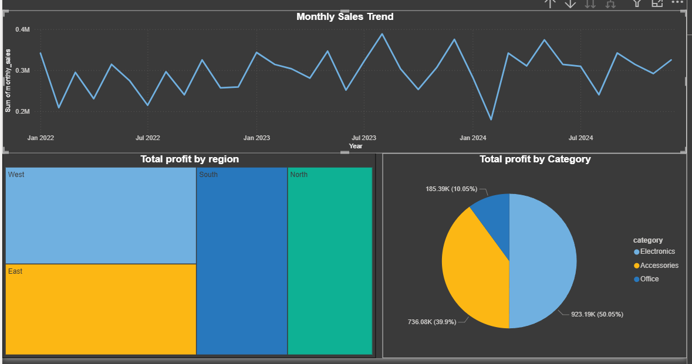

# E-commerce Sales Analysis (SQL + Power BI)

## 📌 Project Overview
This project analyzes e-commerce sales data to identify key insights related to
sales performance, profitability, product categories, and regional trends.

## 📊 Dataset
The dataset consists of three tables:
- Orders
- Order_Item_Table
- Products_Table

Total records: ~3500 orders

## 🛠 Tools & Technologies
- MySQL
- Power BI
- Excel
- GitHub

## 🔍 Key Analysis Performed
- Total sales and profit analysis
- Category-wise and product-wise performance
- Region-wise sales analysis
- Monthly sales trend
- Profit margin calculation

 📁 **SQL Scripts:** [View queries folder](SQL-Query)
 

## 📈 Dashboard Preview

## ✅ Key Learnings
- Database normalization
- SQL joins and aggregations
- Business-focused analysis
- Data visualization best practices

